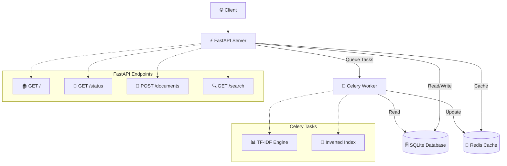

# 🔍 SearchEngine2.0

[](https://python.org)
[](https://fastapi.tiangolo.com)
[](https://redis.io)
[](https://docker.com)
[](https://opensource.org/licenses/MIT)

> **A production-ready search engine that can processes 20,000+ documents with 1M+ terms, delivering sub-100ms search responses through intelligent caching and async processing.**

Built in less than 7 days as a follow up to my [previous search engine](https://github.com/keshavpj1711/Search-Engine), this was built keeping in mind how to scale systems and provide backend as a service, this version of my search engine, features TF-IDF ranking, real-time indexing, and containerized deployment.

---

## 📊 Performance Highlights

| Metric | Achievement | Improvement |
|--------|-------------|-------------|
| **Document Processing** | 2,000 Wikipedia articles indexed | Scalable to 20,000+ |
| **Term Extraction** | 199,788 unique terms processed(For 2,000 articles) | - |
| **Startup Speed** | 1-3 seconds with Redis cache | **15x faster** than cold start |
| **Search Response** | <100ms with inverted index | **80x faster** than linear search |
| **API Response** | <200ms document addition | Real-time with background processing |
| **Concurrent Scraping** | 5 simultaneous connections | 3-retry logic, 95%+ success rate |
| **Cache Efficiency** | Instant TF-IDF data loading | Zero rebuild time on restart |

---

## 🏗️ Architecture Overview



## Tech Stack


- **Backend**: FastAPI, Python 3.10+
- **Database**: SQLite (production-ready for 100K+ documents)
- **Cache**: Redis (TF-IDF data, inverted index)
- **Background Tasks**: Celery with Redis broker
- **Containerization**: Docker, docker-compose
- **Web Scraping**: aiohttp, BeautifulSoup4
- **Search Algorithm**: TF-IDF with inverted index

---

## ⚡ Quick Start

Get SearchEngine2.0 running in under 2 minutes:

```bash
# Clone the repository

git clone https://github.com/keshavpj1711/searchEng2.0.git
cd searchEng2.0

# Start the entire stack

docker-compose up --build

# First run automatically:

# ✅ Fetches N number of articles from Wikipedia's Featured articles, where N is provided by the user

# ✅ Builds TF-IDF index (199,788 terms for 2000 articles in my case)

# ✅ Starts API server on http://localhost:8000

# ✅ Launches background worker for real-time updates

```

**That's it!** The system handles first-time setup automatically.

### **Verify Installation**

```bash
# Check API status

curl http://localhost:8000/status

# Search for articles

curl "http://localhost:8000/search?query=football\&limit=5"

# View interactive docs provided via Swagger UI

open http://localhost:8000/docs

```

---

## 🔧 Features & Capabilities

### **🚀 High-Performance Search**
- **TF-IDF Ranking**: Relevance-based scoring algorithm
- **Inverted Index**: O(log n) search complexity
- **Sub-100ms Responses**: Cached data structures
- **Real-time Updates**: Background indexing via Celery

### **📈 Scalable Architecture**
- **Async Processing**: FastAPI + aiohttp for high concurrency
- **Redis Caching**: 15x faster startup, instant search
- **Background Workers**: Non-blocking document processing
- **Containerized Deployment**: Docker-ready for any environment

### **🛡️ Production-Ready Features**
- **Robust Error Handling**: Retry logic with exponential backoff
- **Rate-Limited Scraping**: Respectful Wikipedia crawling
- **Cache Consistency**: Automatic stale data detection
- **Health Monitoring**: Comprehensive status endpoints

### **🔧 Developer Experience**
- **One-Command Setup**: `docker-compose up --build`
- **Interactive API Docs**: Swagger UI included
- **Modular Architecture**: Clean separation of concerns
- **Comprehensive Logging**: Detailed operation tracking

---

## 📈 Performance Analysis

### **Caching Impact**
```

Without Redis Cache:
├── Startup Time: ~45 seconds
├── TF-IDF Calculation: ~30 seconds
├── Index Building: ~15 seconds
└── Memory Usage: High (recalculation overhead)

With Redis Cache:
├── Startup Time: ~3 seconds (15x improvement)
├── TF-IDF Loading: <1 second (instant)
├── Index Loading: <1 second (instant)
└── Memory Usage: Optimized (pre-computed data)

```

### **Search Performance Comparison**
| Method | Time Complexity | Response Time | Scalability |
|--------|----------------|---------------|-------------|
| Linear Search | O(n) | ~8-12 seconds | Poor |
| **TF-IDF + Inverted Index** | **O(log n)** | **<100ms** | **Excellent** |

### **Concurrent Processing**
- **Batch Size**: 100 articles per batch
- **Concurrent Connections**: 5 simultaneous requests
- **Success Rate**: 95%+ with retry logic
- **Throughput**: ~300 articles/minute with error handling

---

## 🛠️ API Documentation

<details>
<summary><strong>📝 Core Endpoints</strong></summary>

### **GET /status**
Health check endpoint

```bash
curl http://localhost:8000/status

```

```bash
{
"status": "API is up and running",
"message": "Operational"
}
```

### **POST /documents**
Add a new document to the search index

```bash
curl -X POST "http://localhost:8000/documents" \
-H "Content-Type: application/json" \
-d '{
  "title": "Machine Learning Basics",
  "url": "https://example.com/ml-basics",
  "content": "Machine learning is a subset of artificial intelligence..."
}'
```

```json
{
  "id": 2001,
  "title": "Machine Learning Basics",
  "url": "https://example.com/ml-basics",
  "content": "Machine learning is a subset...",
  "retrieved_at": "2025-06-08T15:30:00Z"
}
```

### **GET /search**
Search documents with TF-IDF ranking

```bash
curl "http://localhost:8000/search?query=football\&limit=10"
```

```json
{
  "query": "football",
  "total_results": 42,
  "results": [
    {
      "id": 1337,
      "title": "Machine Learning",
      "url": "https://en.wikipedia.org/wiki/Machine_learning",
      "score": 0.8945,
      "snippet": "Machine learning is a method of data analysis..."
    }
  ],
  "search_time_ms": 87
}
```

</details>


---

## 🏛️ Technical Deep Dive

### **TF-IDF Implementation**
The search engine uses **Term Frequency-Inverse Document Frequency** for relevance ranking:

```python
# TF-IDF Formula Implementation
tf_idf_score = (term_freq / total_terms) * log(total_docs / docs_containing_term)

```

**Why TF-IDF?**
- **Term Frequency**: Rewards documents with repeated relevant terms
- **Inverse Document Frequency**: Penalizes common words, boosts rare terms
- **Proven Algorithm**: Used by major search engines and information retrieval systems

### **Inverted Index Structure**

```python
inverted_index = {
  "machine": [(doc_1, 0.89), (doc_15, 0.76), (doc_42, 0.65)],
  "learning": [(doc_1, 0.92), (doc_8, 0.81), (doc_15, 0.73)],
  # Sorted by TF-IDF score (highest first)
}

```

### **Async Architecture Benefits**
- **Non-blocking I/O**: Handle thousands of concurrent requests
- **Background Processing**: Document indexing doesn't block API responses
- **Resource Efficiency**: Single-threaded with event loop optimization

### **Cache Invalidation Strategy**

```python
# Smart cache refresh logic
if database_doc_count != cached_doc_count:
  trigger_background_reindex()
  update_cache_with_fresh_data()
```

### **Error Resilience**
- **Exponential Backoff**: 2, 4, 8 second delays between retries
- **Circuit Breaker Pattern**: Fail fast on persistent errors
- **Graceful Degradation**: Partial results on timeout

---

## 🧪 Development Setup

### Clone repository

```bash
git clone https://github.com/keshavpj1711/searchEng2.0.git
cd searchEng2.0
```

> Since, before doing any form of testing or development you will have to clone this repo first

### **Docker development**

The easiest way to get started - everything runs in containers with zero configuration:

**Start the entire stack:**

```bash
docker-compose up --build
```

**What this does:**

<details>
  <summary>For the first time: 1️⃣</summary>

- ✅ Builds FastAPI application container
- ✅ Starts Redis cache container
- ✅ Starts Celery worker container
- ✅ Creates the database file to start with 
- ✅ Asks how many articles to fetch from available articles
- ✅ Ingests the fetched articles to db directly
- ✅ Builds TF-IDF index from the fetched articles
- ✅ Initializes the FAST API Application and Starts the app
- ✅ API available at http://localhost:8000
- ✅ Interactive docs at http://localhost:8000/docs

</details>

<details>
  <summary>After the app setup is completed once</summary>

- FastAPI application startup: Initializing database via lifespan...
- Checks for cache staleness
- Loads TF-IDF data 
- Loads Inverted index 

</details>

<br>

**Key Docker commands to work your way**
```bash 
# View logs from all services

docker-compose logs -f

# View logs from specific service

docker-compose logs -f web
docker-compose logs -f celery_worker
docker-compose logs -f redis

# Restart specific service

docker-compose restart web

# Stop all services

docker-compose down

# Rebuild and restart

docker-compose up --build

# Scale Celery workers

docker-compose up --scale celery_worker=3

# Clean restart (removes volumes)

docker-compose down -v
docker-compose up --build

# Check running containers

docker-compose ps

# If containers fail to start

docker-compose down
docker system prune -f
docker-compose up --build

# Check container resource usage

docker stats
```

### **Local Development**

**Create virtual environment**

```bash
python -m venv venv
source venv/bin/activate  \# On Windows: venv\Scripts\activate
```

**Install dependencies**

```bash
pip install -r requirements.txt
```

**Start Redis (required)**

```bash
redis-server
```

**Start FastAPI server**

```bash
uvicorn app.main:app --reload
```
**Start Celery worker (separate terminal)** 

```bash
celery -A app.celery_app worker --loglevel=info
```

### **Project Structure**

```bash
SearchEngine2.0/
├── app/
│   ├── main.py              \# FastAPI application
│   ├── celery_app.py        \# Celery configuration
│   ├── core/
│   │   └── config.py        \# Settings management
│   ├── db/
│   │   └── database_utils.py \# Database operations
│   ├── services/
│   │   ├── tfidf.py         \# TF-IDF implementation
│   │   ├── build_tfidf_data.py
│   │   ├── build_inv_index.py
│   │   ├── search_logic.py   \# Search algorithms
│   │   └── redis_client.py   \# Cache management
│   ├── tasks/
│   │   └── indexing_tasks.py \# Background tasks
│   ├── ingest_articles.py   \# Bulk data import
│   └── setup.py             \# First-time setup
├── crawler/
│   └── crawler.py           \# Wikipedia scraper
├── data/                    \# SQLite DB, JSON files
├── docker-compose.yml       \# Container orchestration
├── Dockerfile              \# Container definition
├── requirements.txt        \# Python dependencies
└── README.md               \# This file
```

## 🎯 Future Enhancements

- [ ] **BM25 Ranking**: Upgrade from TF-IDF to BM25 for better relevance
- [ ] **Elasticsearch Integration**: Scale to millions of documents(Still not sure about it)
- [ ] **React Frontend**: Web interface for search functionality
- [ ] **JWT Authentication**: Secure API access
- [ ] **Rate Limiting**: API usage controls

---

## 🤝 Contributing

1. Fork the repository
2. Create a feature branch (`git checkout -b feature/amazing-feature`)
3. Commit your changes (`git commit -m 'Add amazing feature'`)
4. Push to the branch (`git push origin feature/amazing-feature`)
5. Open a Pull Request

---

## 📝 License

This project is licensed under the MIT License - see the [LICENSE](LICENSE) file for details.

---

## 🙏 Acknowledgments

- **Wikipedia**: For providing high-quality content for indexing
- **FastAPI**: For the excellent async web framework
- **Redis**: For blazing-fast caching capabilities
- **Celery**: For robust background task processing
- **Perplexity AI**: For helping me out simplify some of my complex ideas and helping me with my bugs 

---

**Built with ❤️ in 7 days | Showcasing scalable backend architecture**
